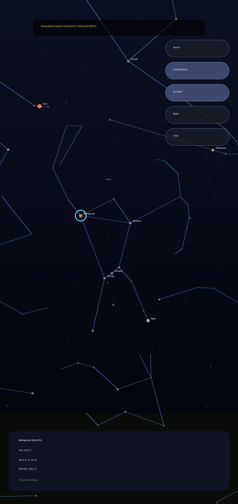
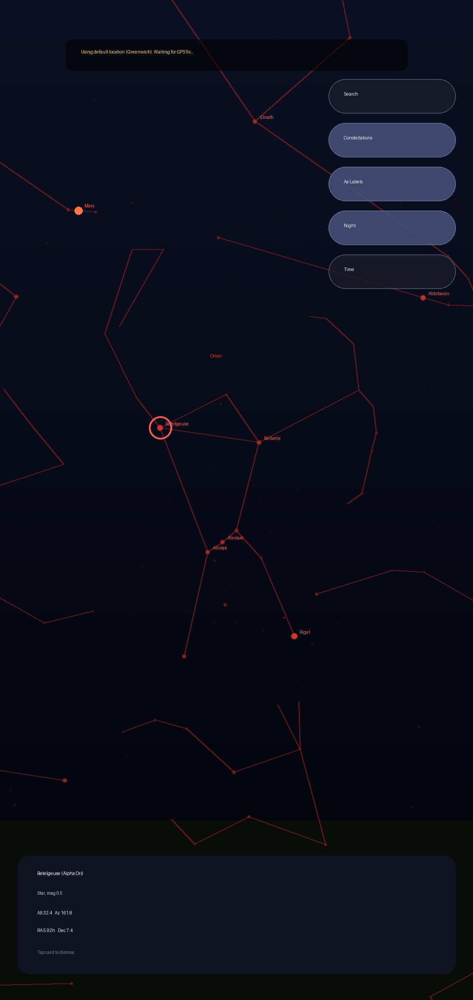

# StellAR — AR Sky Map for Android

A Stellarium-style **augmented reality sky map**: point your phone at the sky and
see stars, constellations and planets overlaid on the live camera feed, aligned
in real time using the device's GPS and motion sensors.

| AR view | Night mode |
|---|---|
|  |  |

*(Screenshots are renders generated from the app's actual star catalogue and
constellation data.)*

## Features

- **Real star catalogue** — 5,044 stars to magnitude 6.0 (Hipparcos subset via
  the BSD-licensed [d3-celestial](https://github.com/ofrohn/d3-celestial)
  dataset), with magnitude-based brightness and B−V colour tinting.
- **88 constellations** — line figures and English name labels, toggleable.
- **Planets, Sun & Moon** — computed on-device from Keplerian mean elements
  (JPL/Standish 1800–2050) and the Astronomical Almanac's low-precision lunar
  series. Accuracy: arc-minutes for planets, ~0.3° for the Moon — far below
  what phone sensors can resolve.
- **True AR alignment** — live camera passthrough (CameraX) with an OpenGL ES 2
  celestial sphere on top, driven by the OS-fused rotation-vector sensor
  (gyroscope + accelerometer + magnetometer) with an additional quaternion
  low-pass filter for stable, swim-free tracking. Magnetic declination is
  corrected via `GeomagneticField`, and the virtual field of view is matched to
  the physical camera optics read from Camera2 characteristics.
- **GPS positioning** — platform `LocationManager` (no Play Services), with a
  graceful Greenwich fallback until a fix arrives.
- **Tap to identify** — tap any star, planet or constellation for name, type,
  magnitude, live altitude/azimuth and RA/Dec.
- **Search** — find "Mars", "Orion", "Betelgeuse"… an on-screen guidance arrow
  points you to objects that are currently off screen.
- **Time control** — scrub ±hours/days to preview the sky at another time.
- **Night mode** — red-tinted rendering and labels to preserve dark adaptation.
- **Sensor calibration prompt** — figure-8 hint appears automatically when the
  compass reports low accuracy.

## How the AR works

```
                    stars.csv / constellations.json          GPS + clock
                                 │                                │
                                 ▼                                ▼
   J2000 unit vectors ──► [Equatorial → ENU matrix]  (latitude, sidereal time)
                                 │
                                 ▼
                 [magnetic declination rotation Rz(d)]
                                 │
   rotation-vector sensor ──► [view matrix]   (device attitude, display rotation)
                                 │
   camera optics (Camera2) ──► [projection]   (FOV matched to the lens)
                                 │
                                 ▼
              GL points & lines over the CameraX preview
              + Canvas overlay for labels, selection, hit-testing
```

The same matrices are shared (through `SkyStateBridge`) with a Canvas overlay
that draws labels, cardinal-direction markers, the selection ring and the
off-screen guidance arrow, and performs tap hit-testing.

> **Why not ARCore/Sceneform?** Sceneform is deprecated, and ARCore's
> world-tracking (SLAM on nearby geometry) adds little for objects at infinity
> while restricting the supported-device list and binary size. Sensor-fusion AR
> with camera passthrough is the same approach used by the classic Google Sky
> Map and keeps the app lightweight. The rendering is cleanly isolated behind
> `SkyStateBridge`, so swapping the view matrix source for an ARCore camera
> pose later is a contained change (see Roadmap).

## Project structure

```
StellAR/
├── .github/workflows/android-ci.yml      # CI: lint, test, build, upload APK
├── app/
│   ├── build.gradle.kts
│   └── src/
│       ├── main/
│       │   ├── AndroidManifest.xml
│       │   ├── assets/
│       │   │   ├── stars.csv              # 5,044 stars (HIP, RA, Dec, mag, B-V, names)
│       │   │   └── constellations.json    # 88 constellation figures + labels
│       │   ├── java/com/stellar/app/
│       │   │   ├── astronomy/
│       │   │   │   ├── AstroTime.kt       # Julian Day, GMST/LST
│       │   │   │   ├── Coordinates.kt     # equatorial ↔ horizontal, ENU matrix
│       │   │   │   └── Planets.kt         # Keplerian ephemeris, Sun, Moon
│       │   │   ├── data/
│       │   │   │   ├── StarCatalog.kt     # CSV loader (flat arrays)
│       │   │   │   ├── ConstellationCatalog.kt
│       │   │   │   ├── SkyObject.kt       # search/selection model
│       │   │   │   └── SkyRepository.kt   # asset loading + search index
│       │   │   ├── rendering/
│       │   │   │   ├── SkyRenderer.kt     # GLES2 stars/lines/planets
│       │   │   │   ├── SkyStateBridge.kt  # thread-safe render state
│       │   │   │   └── StarColor.kt       # B-V → RGB
│       │   │   ├── sensors/
│       │   │   │   ├── OrientationProvider.kt  # rotation vector → view matrix
│       │   │   │   └── LocationProvider.kt     # GPS/network location
│       │   │   └── ui/
│       │   │       ├── MainActivity.kt    # wiring, CameraX, permissions
│       │   │       ├── SkyViewModel.kt    # MVVM state holder
│       │   │       ├── SkyOverlayView.kt  # labels, selection, hit-testing
│       │   │       └── SearchDialogFragment.kt
│       │   └── res/                       # layouts, themes, strings, icon
│       └── test/                          # astronomy engine unit tests
├── docs/                                  # screenshots
├── tools/prepare_data.py                  # regenerates the bundled sky data
├── build.gradle.kts · settings.gradle.kts · gradle/ · gradlew
├── LICENSE (MIT) · NOTICE (data attribution)
└── README.md
```

**Architecture:** MVVM. `SkyViewModel` owns all observable state and the sensor
providers; `MainActivity` is a thin wiring layer; rendering reads inputs and
publishes per-frame matrices through the thread-safe `SkyStateBridge`.

## Getting started

### Requirements

- Android device with a gyroscope/rotation-vector sensor (any phone from the
  last decade), running **Android 8.0 (API 26)** or newer
- JDK 17 and the Android SDK (API 34) for local builds — or just use CI

### Clone & build locally

```bash
git clone https://github.com/githintz/StellAR.git
cd StellAR
./gradlew assembleRelease        # APK: app/build/outputs/apk/release/app-release.apk
./gradlew testDebugUnitTest      # astronomy engine unit tests
./gradlew lintDebug              # lint report
adb install app/build/outputs/apk/release/app-release.apk
```

Or open the project in Android Studio (Hedgehog or newer) and press Run.

### Download the APK from GitHub Actions

Every push builds the app automatically:

1. Open the repo's **Actions** tab and pick the latest **Android CI** run.
2. Download the **app-release** artifact (contains `app-release.apk`).
3. Unzip, copy to your phone and install (enable "install from unknown
   sources"). The release build is signed with a debug key — fine for
   sideloading; replace the signing config for store distribution.

### Using the app

Grant camera + location permission, step outside, and point the phone at the
sky. Tap objects to identify them; use **Search** to get a guidance arrow to
anything; **Night** switches to dark-adaptation red; **Time** lets you scrub
the clock. If the compass banner appears, wave the phone in a figure-8.

## Data & accuracy notes

| Component | Source / method | Accuracy |
|---|---|---|
| Stars | Hipparcos via d3-celestial (BSD-3) | catalogue-grade |
| Constellation figures | d3-celestial (BSD-3) | — |
| Sidereal time | IAU 1982 GMST | < 1″ |
| Planets | Standish mean elements (1800–2050) | arc-minutes |
| Moon | Astronomical Almanac low-precision series | ~0.3° |
| Precession/nutation/refraction | ignored | < 0.5° combined |
| Sensor pointing | rotation vector + nlerp smoothing | typically 1–5° |

The dominant error source is always the magnetometer, so the simplified
astronomy is the right trade-off. All math lives behind small, pure
functions with unit tests, ready to be upgraded (VSOP87, ELP2000, precession)
without touching the rendering or UI.

To regenerate the bundled catalogues (e.g. with a different magnitude limit):

```bash
python3 tools/prepare_data.py
```

## Roadmap

- ARCore camera-pose fusion (drift-free tracking indoors and near metal) — slot
  the ARCore pose in as the `SkyStateBridge` view matrix
- Deep-sky objects (Messier catalogue), star-rise/set times
- Precession + atmospheric refraction corrections
- Manual alignment calibration ("drag the sky to match")

## License

- Code: [MIT](LICENSE)
- Bundled sky data: derived from [d3-celestial](https://github.com/ofrohn/d3-celestial)
  (BSD-3-Clause, © Olaf Frohn), itself based on the ESA Hipparcos catalogue —
  see [NOTICE](NOTICE). No Stellarium code or data is used.
